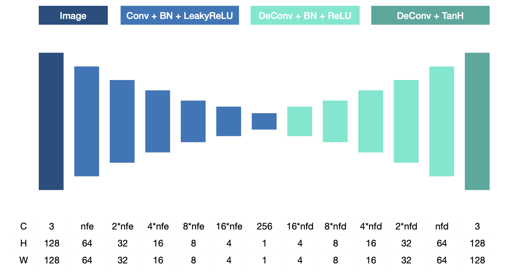
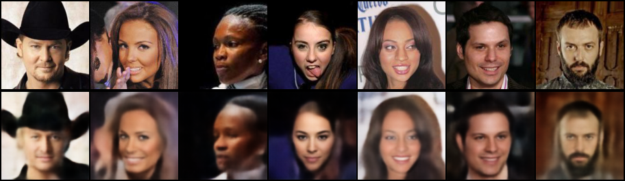

# Convolutional Autoencoder in PyTorch Lightning




This project presents a deep convolutional autoencoder which I developed in collaboration with a fellow student [Li Nguyen](https://github.com/nichtwegzudenken) for an assignment in the Machine Learning Applications for Computer Graphics class at Tel Aviv University. To find out more about the assignment results please read the [report](docs/report.pdf).

## Setup Instructions

Install the required dependencies. Consider creating a virtual environment first.
```bash
pip install -r requirements.txt
```

Save your data in a directory of your choice. We used the celebrity dataset [CelebA](http://mmlab.ie.cuhk.edu.hk/projects/CelebA.html) from the paper [Deep Learning Face Attributes in the Wild](https://liuziwei7.github.io/projects/FaceAttributes.html) presented at ICCV 2015. If you would like to use your own data, the only thing you need to adjust are the training, validation and test splits in the `prepare_data()` method.

The `autoencoder.py` script supports the following command line arguments.  
```bash
python autoencoder.py -h               
usage: autoencoder.py [-h] [--data_root DATA_ROOT] [--log_dir LOG_DIR] [--num_workers NUM_WORKERS] [--image_size IMAGE_SIZE]
                      [--max_epochs MAX_EPOCHS] [--batch_size BATCH_SIZE] [--nc NC] [--nz NZ] [--nfe NFE] [--nfd NFD] [--lr LR] [--beta1 BETA1]
                      [--beta2 BETA2] [--gpus GPUS]

optional arguments:
  -h, --help            show this help message and exit
  --data_root DATA_ROOT
                        Data root directory
  --log_dir LOG_DIR     Logging directory
  --num_workers NUM_WORKERS
                        num_workers > 0 turns on multi-process data loading
  --image_size IMAGE_SIZE
                        Spatial size of training images
  --max_epochs MAX_EPOCHS
                        Number of maximum training epochs
  --batch_size BATCH_SIZE
                        Batch size during training
  --nc NC               Number of channels in the training images
  --nz NZ               Size of latent vector z
  --nfe NFE             Size of feature maps in encoder
  --nfd NFD             Size of feature maps in decoder
  --lr LR               Learning rate for optimizer
  --beta1 BETA1         Beta1 hyperparameter for Adam optimizer
  --beta2 BETA2         Beta2 hyperparameter for Adam optimizer
  --gpus GPUS           Number of GPUs. Use 0 for CPU mode
```

## Training the Autoencoder

To train the autoencoder simply pass in the path where your data is located and the number of GPUs you would like to train on. 
```bash
python autoencoder.py --data_root data --gpus 2
```

Fire up Tensorboard to visualize the training progress of your network in your browser under `http://localhost:6006/`.

```bash
tensorboard --logdir logs
```

## Results Summary

The input images with shape 3 * 128 * 128 are encoded into a 1D bottleneck of size 256. This corresponds to a compression of 95.31%. We decode the images such that the reconstructed images match the original images as closely as possible. We use a MSE reconstruction loss for this. We tried several different architectures and hyperparameters. The following is our best performing model and below we show some visual results (original images in top row, reconstructed images in bottom row).

```bash
----------------------------------------------------------------
        Layer (type)               Output Shape         Param #
================================================================
            Conv2d-1           [-1, 64, 64, 64]           3,072
       BatchNorm2d-2           [-1, 64, 64, 64]             128
         LeakyReLU-3           [-1, 64, 64, 64]               0
            Conv2d-4          [-1, 128, 32, 32]         131,072
       BatchNorm2d-5          [-1, 128, 32, 32]             256
         LeakyReLU-6          [-1, 128, 32, 32]               0
            Conv2d-7          [-1, 256, 16, 16]         524,288
       BatchNorm2d-8          [-1, 256, 16, 16]             512
         LeakyReLU-9          [-1, 256, 16, 16]               0
           Conv2d-10            [-1, 512, 8, 8]       2,097,152
      BatchNorm2d-11            [-1, 512, 8, 8]           1,024
        LeakyReLU-12            [-1, 512, 8, 8]               0
           Conv2d-13           [-1, 1024, 4, 4]       8,388,608
      BatchNorm2d-14           [-1, 1024, 4, 4]           2,048
        LeakyReLU-15           [-1, 1024, 4, 4]               0
           Conv2d-16            [-1, 256, 1, 1]       4,194,304
      BatchNorm2d-17            [-1, 256, 1, 1]             512
        LeakyReLU-18            [-1, 256, 1, 1]               0
  ConvTranspose2d-19           [-1, 1024, 4, 4]       4,194,304
      BatchNorm2d-20           [-1, 1024, 4, 4]           2,048
             ReLU-21           [-1, 1024, 4, 4]               0
  ConvTranspose2d-22            [-1, 512, 8, 8]       8,388,608
      BatchNorm2d-23            [-1, 512, 8, 8]           1,024
             ReLU-24            [-1, 512, 8, 8]               0
  ConvTranspose2d-25          [-1, 256, 16, 16]       2,097,152
      BatchNorm2d-26          [-1, 256, 16, 16]             512
             ReLU-27          [-1, 256, 16, 16]               0
  ConvTranspose2d-28          [-1, 128, 32, 32]         524,288
      BatchNorm2d-29          [-1, 128, 32, 32]             256
             ReLU-30          [-1, 128, 32, 32]               0
  ConvTranspose2d-31           [-1, 64, 64, 64]         131,072
      BatchNorm2d-32           [-1, 64, 64, 64]             128
             ReLU-33           [-1, 64, 64, 64]               0
  ConvTranspose2d-34          [-1, 3, 128, 128]           3,072
             Tanh-35          [-1, 3, 128, 128]               0
================================================================
Total params: 30,685,440
Trainable params: 30,685,440
Non-trainable params: 0
----------------------------------------------------------------
Input size (MB): 0.19
Forward/backward pass size (MB): 24.01
Params size (MB): 117.06
Estimated Total Size (MB): 141.25
----------------------------------------------------------------
```

